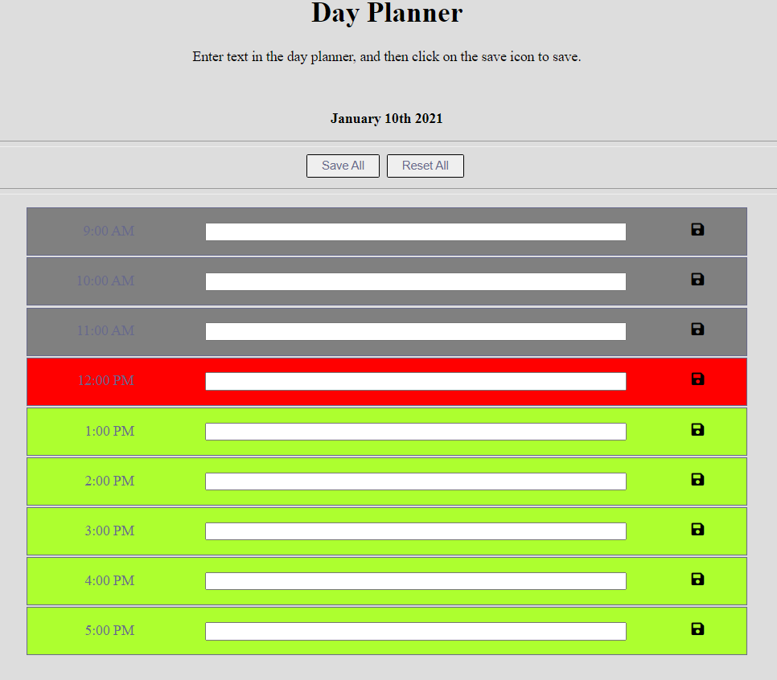

# Day Planner
**UofT Coding Bootcamp Week 5 Challenge - Day Planner**  
🔗 [Link to deployment page](https://terrencejchan.github.io/day-planner/)

This page allows the user to enter tasks for the work day and to save them so that when they revisit the page, they can see what they saved before.  

The planner conveniently features colour coding to allow the user to know what hours have passed, what hour it currently is, and what hours are yet to come.

## Logic
Using moment.js, the page's JavaScript checks for what time of day it is for the user. It then greys hours that have passed, reddens the hour that it is currently, and makes green the hours that have not passed yet. If it is before work hours, then all the blocks will be green. If it is after, then they will all be grey.

When the user enters text into the timeblocks, they can save their text by clicking on the relevant save icon, or the save all button. Doing so will save the information to the browser's localStorage.

When the user reloads the page, the JavaScript will get the localStorage items, strip the quotation marks away from the strings, and display them in the textboxes.